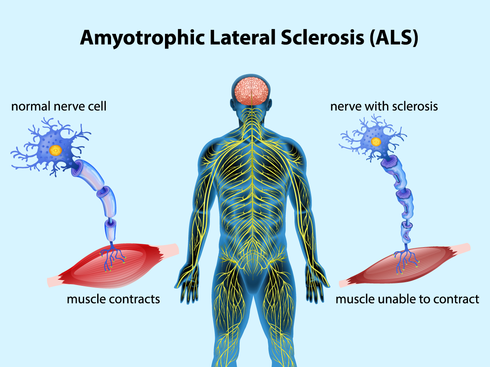

# Longitudinal plasma proteomics predict phenoconversion to clinically manifest ALS (ALS)

[](https://doi.org/10.1038/s41591-026-04528-x)

<!--  -->
<!--  -->

## Contents


* [Overview](#overview)
* [Repo Contents](#repo-contents)
* [Analysis Folder Guide](#analysis-folder-guide)
* [Figures](#figures) (Main · Extended Data · Supplementary)
* [System Requirements](#system-requirements)
* [Installation Guide](#installation-guide)
* [License](#license)
* [Citation](#citation)


## Overview

This study identifies plasma protein biomarkers for ALS and develops predictive models for phenoconversion. We analyze differentially regulated proteins, track their longitudinal trajectories, and build models to predict disease onset timing. Findings are validated using UK Biobank data.

## Repo Contents

```
├── analysis/                          # End-to-end statistical workflow
│   ├── 01-Discovery/                  # Discovery cohort analyses (R scripts)
│   │   ├── 01-1_differential_expression.R
│   │   ├── 01-2_pathway_enrichment.R
│   │   ├── 02-1_delta_matrix.R
│   │   ├── 02-2_trajectories.R
│   │   ├── 03_cox_model_baseline.R
│   │   ├── 04-1_binary_logistic.R
│   │   ├── 04-2_binary_logistic_data_driven.R
│   │   └── 05_phenoconversion_timing.R
│   └── 02-Replication/               # UK Biobank replication (Python/Jupyter)
│       ├── 00-Data-prepration/        # Data extraction & cleaning
│       │   ├── 1.Protein_matrix/      #   Olink protein matrix extraction
│       │   ├── 2.Pheno/               #   Phenotype data cleaning
│       │   ├── 3.Genotype/            #   SOD1, C9orf72, other variant calling
│       │   └── 4.Visit_selection/     #   Subject & visit selection
│       ├── 01_Differentially_Expressed_Proteins_limma.ipynb
│       ├── 02-1_Delta_matrix.ipynb
│       ├── 02-2_Protein_Trajectories_All.ipynb
│       ├── 03_Cox_Model_Baseline_UKB.ipynb
│       └── 04_Phenoconversion_Timing_UKB_Horizons.ipynb
├── figure/                            # Figure generation scripts and outputs
│   ├── Fig1/ – Fig5/                  # Main figure R scripts and results/
│   └── Supplement_Figure/             # Supplementary figure R scripts and results/
├── REQUIREMENTS.md                    # Auto-generated R package dependency list
└── LICENSE
```

## Analysis Folder Guide

The `analysis/` directory contains the end-to-end statistical workflow, organized into a discovery cohort and a UK Biobank replication cohort.

<!-- ### Cohort group definitions

Participants are assigned to clinical groups by disease stage. Both cohorts share the same stage labels; the UK Biobank replication additionally resolves the pre-manifest window into two stages (`Phenoconverter` and `Pre-hospital`) relative to the hospital diagnosis date.

**Discovery cohort** — groups are stored as numeric codes `0`–`3` in the data and map to:

| Code | Display label | Definition |
|------|---------------|------------|
| `0` | Healthy control | Non-carrier, no ALS |
| `1` | Pre-symptomatic | Asymptomatic ALS-gene carrier (SOD1 / C9orf72) |
| `2` | Phenoconverter | Carrier observed converting to clinically manifest ALS |
| `3` | Clinically manifest ALS | Symptomatic, post-onset ALS |

**Replication cohort — UK Biobank** — the group labels below are the actual factor-level strings used throughout `analysis/02-Replication/`:

| Group | Definition |
|-------|------------|
| `Healthy control` | Non-carrier, nervous-system free, no ALS |
| `Pre-symptomatic` | Asymptomatic ALS-gene carrier (SOD1 nonA4V / C9orf72) |
| `Phenoconverter` | Confirmed ALS case, ≥ 2 years before hospital diagnosis |
| `Pre-hospital` | Confirmed ALS case, < 2 years before hospital diagnosis |
| `Clinically manifest ALS` | Confirmed ALS case, after hospital diagnosis |

> Note: `Phenoconverter` and `Pre-hospital` together span the pre-diagnosis window and are pooled in some trajectory/timing analyses. -->

### 01-Discovery (R scripts)

| Script | Description |
|--------|-------------|
| `01-1_differential_expression.R` | lmer-based (linear mixed-effects) differential expression analysis |
| `01-2_pathway_enrichment.R` | Pathway and gene-set enrichment of DE proteins |
| `02-1_delta_matrix.R` | Delta protein matrix: GAMM baseline (age/sex-adjusted) fit on controls, delta = observed − model-predicted expected |
| `02-2_trajectories.R` | Generalized additive mixed models (GAMM, smooth splines) for longitudinal protein trajectories |
| `03_cox_model_baseline.R` | Baseline Cox proportional hazards survival models |
| `04-1_binary_logistic.R` | Binary logistic regression for phenoconversion prediction |
| `04-2_binary_logistic_data_driven.R` | Data-driven greedy forward selection for logistic-regression phenoconversion prediction (maximizes mean cross-validated AUROC across horizons) |
| `05_phenoconversion_timing.R` | Timing estimation to disease manifestation |

Run scripts in numbered order (`01` → `05`).

### 02-Replication (Python/Jupyter — UK Biobank)

| Notebook | Description |
|----------|-------------|
| `00-Data-prepration/` | Data extraction and cleaning (protein matrix, phenotypes, genotypes, visit selection) |
| `01_Differentially_Expressed_Proteins_limma.ipynb` | Limma-based DE replication in UKB |
| `02-1_Delta_matrix.ipynb` | Delta protein matrix for UKB |
| `02-2_Protein_Trajectories_All.ipynb` | Longitudinal protein trajectories in UKB |
| `03_Cox_Model_Baseline_UKB.ipynb` | Cox survival models in UKB |
| `04_Phenoconversion_Timing_UKB_Horizons.ipynb` | Phenoconversion timing estimation in UKB |

Run notebooks in numbered order, starting with `00-Data-prepration/`.

## Figures

### Main Figures

- **[Figure 1: Plasma markers differential regulation](figure/Fig1/Fig1.R)**
- **[Figure 2: Longitudinal trajectory of biomarkers](figure/Fig2/Fig2_genaral.R)**
- **[Figure 3: Time-to-event analysis](figure/Fig3/Fig3.R)**
- **[Figure 4: Event prediction model performance](figure/Fig4/Fig4.R)**
- **[Figure 5: UK Biobank replication](figure/Fig5/Fig5.R)**

### Extended Data Figures

- **[Extended Data Figure 1: Patient visit timeline](figure/Supplement_Figure/ED_Fig1.R)**
- **[Extended Data Figure 2: Protein trajectory atlas](figure/Supplement_Figure/ED_Fig2_Sup_Fig1.R)**
- **[Extended Data Figure 4: Kaplan–Meier curves for Panel 19 and Panel 15](figure/Supplement_Figure/ED_Fig4.R)**

### Supplementary Figures

- **[Supplementary Figure 1: Protein trajectories in phenoconverters and pre-phenoconverters](figure/Supplement_Figure/ED_Fig2_Sup_Fig1.R)**
- **[Supplementary Figure 2: ML model performance (AUC)](figure/Supplement_Figure/Sup_Fig2.R)**


## System Requirements

### Hardware Requirements

The analysis scripts require a standard computer with sufficient RAM to support R operations. For minimal performance:
- RAM: 4+ GB
- CPU: 2+ cores

For optimal performance, we recommend:
- RAM: 16+ GB
- CPU: 4+ cores, 3.0+ GHz/core

### Software Requirements

#### OS Requirements

The analysis scripts have been tested on the following systems:
- Linux: Ubuntu 18.04+
- Mac OSX: macOS 10.14+
- Windows: Windows 10+

#### R and Package Requirements

**R version:** R version 4.4.0 (2024-04-24) or higher

**Detected R Package Dependencies:**

* **arrow**: 22.0.0
* **cowplot**: 1.2.0
* **dplyr**: 1.1.4
* **extrafont**: 0.20
* **ggforce**: 0.5.0
* **ggnewscale**: 0.5.2
* **ggplot2**: 4.0.1
* **ggplotify**: 0.1.3
* **ggpubr**: 0.6.2
* **ggraph**: 2.2.2
* **ggrepel**: 0.9.6
* **ggsignif**: 0.6.4
* **ggtext**: 0.1.2
* **gprofiler2**: 0.2.4
* **gridExtra**: 2.3
* **here**: 1.0.2
* **igraph**: 2.2.1
* **jtools**: 2.3.0
* **kableExtra**: 1.4.0
* **knitr**: 1.50
* **lme4**: 1.1.38
* **lmerTest**: 3.1.3
* **OlinkAnalyze**: 4.4.0
* **patchwork**: 1.3.2
* **pheatmap**: 1.0.13
* **progress**: 1.2.3
* **purrr**: 1.2.0
* **RColorBrewer**: 1.1.3
* **scales**: 1.4.0
* **stringr**: 1.6.0
* **tibble**: 3.3.0
* **tidygraph**: 1.3.1
* **tidyr**: 1.3.1
* **tidyverse**: 2.0.0
* **UpSetR**: 1.4.0

## Installation Guide

### Installing R

#### On Ubuntu

```bash
sudo apt-get update
sudo apt-get install r-base r-base-dev
```

#### On Mac OSX

Download and install R from [CRAN](https://cran.r-project.org/).

#### On Windows

Download and install R from [CRAN](https://cran.r-project.org/).

### Package Dependencies

Install required packages from an R terminal:

```r
install.packages(c('tidyverse', 'arrow', 'OlinkAnalyze', 'lme4', 'lmerTest', 
                    'gprofiler2', 'igraph', 'tidygraph', 'pheatmap',
                    'ggplot2', 'dplyr', 'gridExtra', 'ggraph', 
                    'RColorBrewer', 'ggpubr', 'cowplot', 'extrafont',
                    'ggforce', 'ggnewscale', 'ggplotify', 'ggrepel',
                    'ggsignif', 'ggtext', 'here', 'jtools', 'kableExtra',
                    'knitr', 'patchwork', 'progress', 'purrr', 'scales',
                    'stringr', 'tibble', 'tidyr', 'UpSetR'))
```

**Note:** Package versions are listed in the [System Requirements](#system-requirements) section above. For specific version requirements, see individual scripts for complete dependency lists.


## License

See [LICENSE](LICENSE) file for details.

## Citation

If you use this code or data, please cite our paper:

> Longitudinal plasma proteomics predict phenoconversion to clinically manifest ALS. *Nature Medicine* (2026). DOI: [10.1038/s41591-026-04528-x](https://doi.org/10.1038/s41591-026-04528-x)   

The article is available at <https://www.nature.com/articles/s41591-026-04528-x>.
